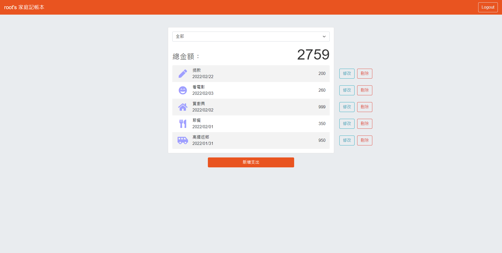

# 老爸的私房錢

## 介紹
老爸是個月光族，於是決定開始養成記帳的習慣
## 功能
登入
- 信箱 & 密碼註冊
- 第三方登入
主要功能
- 瀏覽所有支出(可依類別篩選)
- 新增一筆支出
- 編輯一筆支出
- 刪除一筆支出
## 開始使用
1. clone 專案
2. 進入專案資料夾，安裝所需套件
```bash
npm install
```
3. 在根目錄下建立 .env 檔，可複製.env.example
4. 產生種子資料
```bash
npm run seed
```
5. 啟動專案
```bash
npm run dev
```
6. 出現此訊息代表成功運行
```bash
Listening on http://localhost:3000
```
7. 登入種子帳號
```
信箱: root@gmail.com
密碼: 123
```
## 環境
- Node.js 14.17.6
- MongoDB 5.0.4
## 前端外觀
- Bootstrap 5.1.3
- Font-awesome 5.15.4
## 開發工具
- bcryptjs 2.4.3
- connect-flash 0.1.1
- dotenv 14.3.0
- express 4.17.2
- express-handlebars 6.0.2
- express-session 1.17.2
- method-override 3.0.0
- moment 2.29.1
- mongoose 6.1.8
- passport 0.5.2
- passport-google-oauth20 2.0.0
- passport-local 1.0.0
